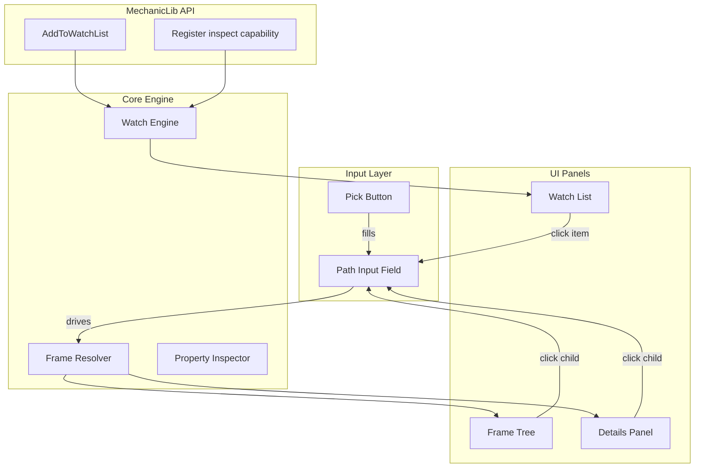

# Phase 8: Inspect Tab ✅ COMPLETE

A unified frame inspection and watch system for !Mechanic that lets developers explore frame hierarchies, inspect properties, and monitor live values.

> **Status**: This phase has been fully implemented. See `UI/Inspect.lua`, `UI/InspectTree.lua`, `UI/InspectDetails.lua`, `UI/InspectWatch.lua`, and `UI/Shared/FrameResolver.lua`.

## Architecture

## Key Files

| File | Purpose |
|------|---------|
| `UI/Inspect.lua` | Main Inspect tab module |
| `UI/InspectTree.lua` | Frame tree component |
| `UI/InspectDetails.lua` | Details panel component |
| `UI/InspectWatch.lua` | Watch list component |
| `UI/Shared/FrameResolver.lua` | Path resolution utility |
| `Libs/MechanicLib/MechanicLib.lua` | New `AddToWatchList` API |

## Implementation Highlights

### 1. MechanicLib API Extensions
Added `AddToWatchList`, `RemoveFromWatchList`, and `GetWatchList` to `MechanicLib`. Version bumped to 1.1 Minor 2.

### 2. Unified Layout
Implemented a three-column layout in the Inspect tab:
- **Left**: Contextual frame tree (ancestors -> self -> children)
- **Center**: Detailed property/script/geometry inspection
- **Right**: Live-updating watch list with auto-refresh (0.5s)

### 3. Pick Mode
Implemented a high-strata overlay that highlights frames under the mouse. Left-clicking captures the frame and populates the path input.

### 4. Watch List
Supports both manual watches and programmatic registration. Watches persist in SavedVariables and show live values (Value, Text, or Visibility).

## Testing Checklist
- [x] Pick mode selects frames correctly
- [x] Path input resolves valid paths
- [x] Invalid paths show clear error
- [x] Tree navigation updates input
- [x] Watch list updates live
- [x] Addon-registered frames appear grouped
- [x] Persistence survives reload
- [x] No taint from inspection APIs

